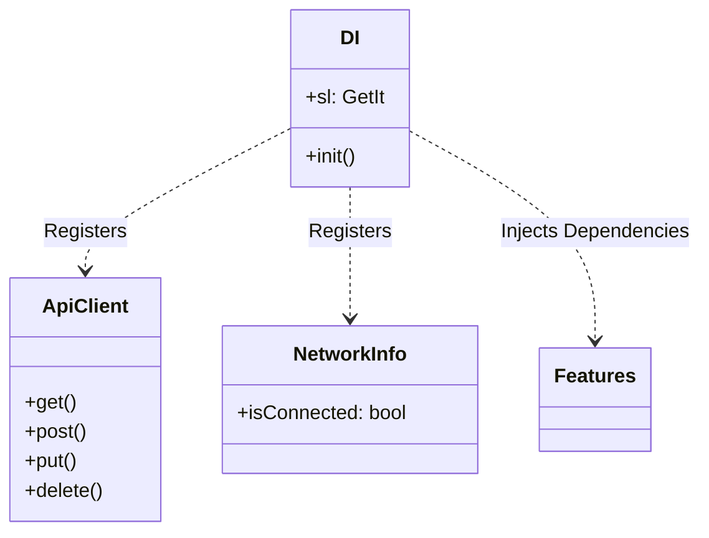
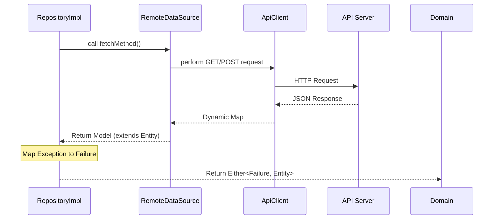
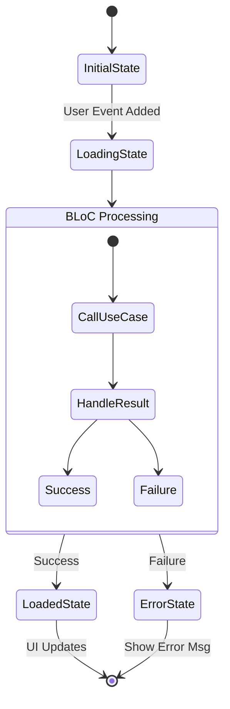

# PRM393 OTIS Project - Architecture & Contribution Guide

Welcome to the OTIS Project codebase. This project adheres to **Clean Architecture** combined with the **BLoC (Business Logic Component)** pattern to ensure scalability, maintainability, and testability.

This document serves as a guideline for the team to understand the structure, where to find things, and how to add new features consistently.

## 🏗 Architecture Overview

We follow the **Separation of Concerns** principle by dividing the project into three main layers:

1.  **Domain Layer (Business Logic)**: The "Brain" of the app. It defines *what* the app does. It contains pure Dart code with no dependencies on Flutter or external libraries (mostly).
2.  **Data Layer (Data Handling)**: The "Limbs" of the app. It handles *how* data is retrieved (API, Database) and converts it for the Domain layer.
3.  **Presentation Layer (UI)**: The "Face" of the app. It displays data to the user and captures events using BLoC.

---

## 📊 Detailed Flow Diagrams (Mermaid)

### 1. Application Entry Flow (`main.dart` & `app.dart`)
This diagram shows how the application starts, initializes dependencies, and launches the UI.

```mermaid
graph TD
    A[main.dart: main()] --> B[WidgetsFlutterBinding.ensureInitialized]
    B --> C[InjectionContainer: init]
    C -->|Register| D[GetIt Service Locator]
    D -->|Dependencies Ready| E[runApp]
    E --> F[app.dart: OtisApp]
    F --> G[MaterialApp]
    G --> H[Initial Route / HomeScreen]
    
    style A fill:#f9f,stroke:#333
    style C fill:#bbf,stroke:#333
    style F fill:#bfb,stroke:#333
```

### 2. Core & Dependency Injection (`lib/core`)
How the `core` module sets up the environment for the rest of the app.



### 3. Data Layer Flow (`lib/data`)
How data is fetched from the remote source and mapped to the domain.



### 4. Domain Layer Structure (`lib/domain`)
The core business logic independent of UI and Data implementation.

```mermaid
graph LR
    subgraph Domain Layer
    A[User Action] -->|.call()| B[UseCase]
    B -->|Calls| C[Repository Interface]
    end
    
    subgraph Data Layer
    C -. Implemented By .-> D[Repository Implementation]
    end
    
    style B fill:#f96,stroke:#333
    style C fill:#69f,stroke:#333
```

### 5. Presentation Layer Flow (`lib/presentation`)
How the UI interacts with BLoC and State.



---

## 📂 Project Structure Explained

The `lib/` folder is organized as follows:

### 1. `core/` (Shared Infrastructure)
*   `injection_container.dart`: Dependency Injection setup.
*   `api_client.dart`: HTTP Wrapper.
*   `failures.dart`: Error handling classes.

### 2. `domain/` (The Contract)
*   **entities/**: Pure data objects (e.g., `User`).
*   **repositories/**: Interfaces (e.g., `AuthRepository`).
*   **usecases/**: Single business actions (e.g., `LoginUseCase`).

### 3. `data/` (The Implementation)
*   **models/**: JSON parsers extension of Entities.
*   **datasources/**: API callers using `ApiClient`.
*   **repositories/**: Implementation of Domain Repositories.

### 4. `presentation/` (The View)
*   **bloc/**: State Management logic.
*   **screens/**: Full page widgets.
*   **widgets/**: Reusable components.

---

## 🚀 Workflow: How to Add a New Feature

Follow this step-by-step flow to maintain consistency:

### Step 1: **Domain Layer**
1.  **Entity**: `domain/entities/my_feature.dart`.
2.  **Repository Interface**: `domain/repositories/my_feature_repository.dart`.
3.  **Use Cases**: `domain/usecases/my_feature/do_something_usecase.dart`.

### Step 2: **Data Layer**
4.  **Model**: `data/models/my_feature_model.dart`.
5.  **DataSource**: `data/datasources/my_feature/my_feature_remote_datasource.dart`.
6.  **Repository Implementation**: `data/repositories/my_feature_repository_impl.dart`.

### Step 3: **Injection**
7.  **DI**: Register all above in `core/injections/injection_container.dart`.

### Step 4: **Presentation Layer**
8.  **BLoC**: Define Events, States, and BLoC logic.
9.  **UI**: Create Screen and connect BLoC.

---

## 🤝 Contribution Rules
*   **Never** write business logic in UI widgets.
*   **Never** import Data layer classes (Models/DTOS) into the Presentation layer.
*   **Always** create a UseCase for an action.
*   **Format** your code using standard Dart formatting.
