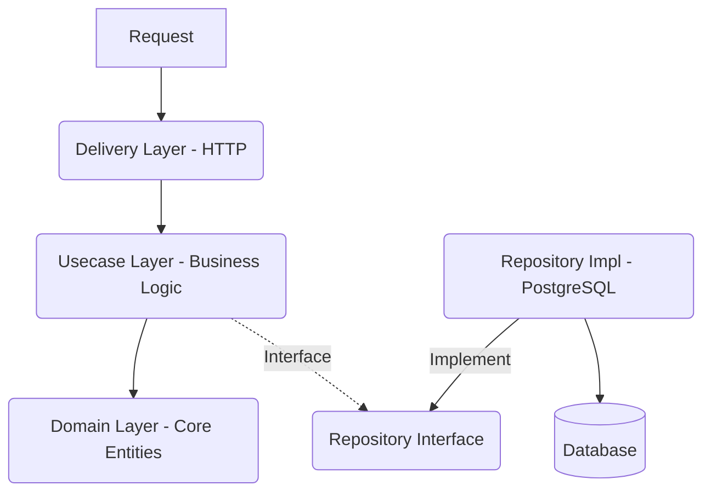

# 🚀 OTIS Backend Convention & Guidelines

Folder PATH listing for volume New Volume
Volume serial number is 40CF-2A5D
D:.
│   .env
│   docker-compose.yml
│   Dockerfile
│   go.mod
│   go.sum
│   main.exe
│   Makefile
│   README.md
│   
├───cmd
│   └───server
│           main.go
│
├───config
│       config.go
│       config.yaml
│       config_docker.yaml
│
├───docs
├───domain
│       billing.go
│       cart.go
│       category.go
│       chat.go
│       map.go
│       notification.go
│       order.go
│       product.go
│       product_detail.go
│       user.go
│
├───internal
│   ├───delivery
│   │   └───http
│   │       │   router.go
│   │       │
│   │       ├───dto
│   │       │       category_response.go
│   │       │       error_response.go
│   │       │       pagination_response.go
│   │       │       product_response.go
│   │       │
│   │       ├───handler
│   │       │       auth_handler.go
│   │       │       billing_handler.go
│   │       │       cart_handler.go
│   │       │       category_handler.go
│   │       │       chat_handler.go
│   │       │       map_handler.go
│   │       │       notification_handler.go
│   │       │       order_handler.go
│   │       │       product_handler.go
│   │       │
│   │       ├───mapper
│   │       │       product_mapper.go
│   │       │
│   │       ├───middleware
│   │       │       cors.go
│   │       │       jwt_redis_middleware.go
│   │       │
│   │       └───response
│   │               response.go
│   │
│   ├───infrastructure
│   │   ├───database
│   │   │       postgres.go
│   │   │
│   │   └───security
│   │           jwt.go
│   │           redis_store.go
│   │
│   ├───repository
│   │   ├───contracts
│   │   │       product_repository.go
│   │   │
│   │   └───postgres
│   │           billing_repo.go
│   │           cart_repo.go
│   │           category_repo.go
│   │           chat_repo.go
│   │           map_repo.go
│   │           notification_repo.go
│   │           order_repo.go
│   │           product_detail_repo.go
│   │           product_repo.go
│   │           user_repo.go
│   │
│   └───usecase
│       │   errors.go
│       │
│       ├───auth
│       │       auth_usecase.go
│       │
│       ├───billing
│       │       billing_usecase.go
│       │
│       ├───cart
│       │       cart_usecase.go
│       │
│       ├───chat
│       │       chat_usecase.go
│       │
│       ├───map
│       │       map_usecase.go
│       │
│       ├───notification
│       │       notification_usecase.go
│       │
│       ├───order
│       │       order_usecase.go
│       │
│       └───product
│               product_usecase.go
│
└───migrations
        init_schema.sql
        seed_products.sql

# 🚀 OTIS Backend Convention & Guidelines

File này định nghĩa các quy ước và tiêu chuẩn phát triển cho dự án backend OTIS, tuân theo Clean Architecture. Mục tiêu là giúp team làm việc đồng bộ (consistent), dễ maintain, và tránh xung đột code.

---

## 🏗️ Kiến trúc Tổng Quan (Clean Architecture)

Dữ liệu di chuyển theo 1 chiều: **Outer Layer -> Inner Layer**.
Dependency Rule: **Classes tại Inner Layer không bao giờ được biết gì về Outer Layer.**



### 1. Domain Layer (`domain/`)
*   **Trách nhiệm**: Chứa các Entity (struct) cốt lõi của ứng dụng. Đây là "trái tim" của hệ thống.
*   **Quy tắc**:
    *   ❌ KHÔNG phụ thuộc vào bất kỳ layer nào khác (không import `http`, `gin`, `gorm`, v.v.).
    *   ❌ KHÔNG chứa tag JSON (trừ khi thực sự cần thiết, tốt hơn là dùng DTO).
    *   ❌ KHÔNG chứa code xử lý database.
*   **Ví dụ**:
    ```go
    // domain/product.go
    type Product struct {
        ID          int64
        Name        string
        Price       float64
        CreatedAt   time.Time
    }
    ```

### 2. Usecase Layer (`internal/usecase/`)
*   **Trách nhiệm**: Chứa Business Logic. Điều phối dữ liệu giữa Delivery và Repository.
*   **Quy tắc**:
    *   ✅ Chỉ import `domain` và `repository interfaces`.
    *   ❌ KHÔNG import `gorm` (database specific).
    *   ❌ KHÔNG import `gin` (http specific).
    *   ✅ Xử lý logic nghiệp vụ (validate nghiệp vụ, tính toán).
*   **Naming**: `[Entity]Usecase`, method: `GetById`, `Create`, `Update`.

### 3. Repository Layer (`internal/repository/`)
*   **Trách nhiệm**: Tương tác trực tiếp với Database (CRUD).
*   **Quy tắc**:
    *   ✅ Implement Interface định nghĩa bởi layer cao hơn (hoặc trong `domain/interfaces`).
    *   ✅ Chuyển đổi dữ liệu DB -> Domain Entity trước khi trả về.
    *   ✅ Sử dụng GORM tại đây.

### 4. Delivery Layer (`internal/delivery/http/`)
*   **Trách nhiệm**: Nhận request từ client, validate input cơ bản, gọi usecase, và trả về response.
*   **Quy tắc**:
    *   ✅ Sử dụng DTO (Data Transfer Object) để nhận/trả dữ liệu.
    *   ✅ Sử dụng Mapper để chuyển đổi: `Request DTO` -> `Domain` -> `Usecase` -> `Domain` -> `Response DTO`.
    *   ❌ KHÔNG xử lý logic nghiệp vụ ở đây.

---

## � Naming Conventions (Quy ước đặt tên)

### 1. File Naming
*   Sử dụng **snake_case** cho tên file.
*   Ví dụ: `auth_handler.go`, `product_usecase.go`, `user_repo.go`.
*   File test: `*_test.go` (ví dụ: `auth_usecase_test.go`).

### 2. Variables & Constants
*   **Global var / Constants**: CamelCase hoặc SCREAMING_SNAKE_CASE (cho const public).
    *   `const MaxRetries = 3`
    *   `var ErrNotFound = errors.New("...")`
*   **Local var**: user camelCase ngắn gọn.
    *   `ctx`, `req`, `res`, `err`, `userFromDB`.

### 3. Interface & Structs
*   **Interface**: Nên có hậu tố `...er` nếu có 1 method (như `Reader`, `Writer`). Nếu là repository/usecase thì đặt rõ nghĩa.
    *   `ProductRepository`, `AuthUsecase`.
*   **Implementation**:
    *   `productRepo` (struct implement `ProductRepository`).
    *   `authUsecase` (struct implement `AuthUsecase`).

---

## ⚡ Error Handling Strategy

Tuyệt đối không bỏ qua lỗi (`_`). Xử lý lỗi phải nhất quán từ dưới lên trên.

1.  **Repository**: Trả về lỗi của DB driver hoặc lỗi wrap nếu cần context.
    *   Nếu không tìm thấy record: trả về `gorm.ErrRecordNotFound` hoặc custom error `domain.ErrNotFound`.
2.  **Usecase**: Nhận lỗi từ Repo.
    *   Nếu lỗi là `ErrNotFound` -> Có thể wrap thành business error `ErrProductNotFound`.
    *   Nếu logic nghiệp vụ sai -> Trả về lỗi business (ví dụ: `ErrInsufficientBalance`).
3.  **Transport (Handler)**: Map error từ Usecase ra HTTP Status Code.
    *   `domain.ErrNotFound` -> 404 Not Found.
    *   `domain.ErrConflict` -> 409 Conflict.
    *   `Validation Error` -> 400 Bad Request.
    *   Các lỗi khác -> 500 Internal Server Error.

---

## �️ Git Workflow & Collaboration

Để tránh conflict khi làm việc nhóm:

1.  **Branching Strategy**:
    *   `main`: Code production, ổn định.
    *   `develop`: Branch tích hợp chính, deployment test.
    *   `feature/[tên-feature]`: Branch cho từng tính năng (ví dụ: `feature/login`, `feature/cart-update`).
    *   `fix/[tên-bug]`: Branch fix bug.

2.  **Pull Request (PR) Process**:
    *   Không commit trực tiếp vào `main` hoặc `develop`.
    *   Tạo PR từ `feature/...` vào `develop`.
    *   Phải pass CI (linter, build).
    *   Phải update file `swagger` nếu có thay đổi API.

3.  **Conflict & Merge**:
    *   Luôn `git pull origin develop` về branch cá nhân thường xuyên để cập nhật code mới nhất.
    *   Resolve conflict tại máy local trước khi push.

---

## ✅ Checklist cho Feature mới
Copy checklist này vào mô tả PR của bạn:

- [ ] Tạo **Entity** trong `domain/` (nếu mới).
- [ ] Tạo/Update **Table** trong DB (migration scripts).
- [ ] Định nghĩa **Interface** Repository.
- [ ] Implement **Repository** trong `internal/repository`.
- [ ] Implement **Usecase** (Logic nghiệp vụ).
- [ ] Tạo **Request/Response DTO** và **Mapper**.
- [ ] Implement **Handler**.
- [ ] Đăng ký **Route** trong `router.go`.
- [ ] Chạy server test thử API.
- [ ] Cập nhật Swagger documentation (nếu cần).

---

## 📌 Các quy tắc vàng (Golden Rules)

1.  **DRY (Don't Repeat Yourself)**: Nếu logic giống nhau, tách ra hàm chung.
2.  **KISS (Keep It Simple Stupid)**: Viết code đơn giản, dễ đọc. Code phức tạp khó maintain.
3.  **Boy Scout Rule**: "Để lại mã nguồn sạch hơn lúc bạn tìm thấy nó". Nếu thấy code xấu/thừa, hãy refactor nhẹ nhàng.
4.  **Comment**: Comment *tại sao* làm vậy, không comment *đang làm gì* (code đã thể hiện điều đó).

---
*Tài liệu này dùng cho nội bộ team Back-end OTIS.*