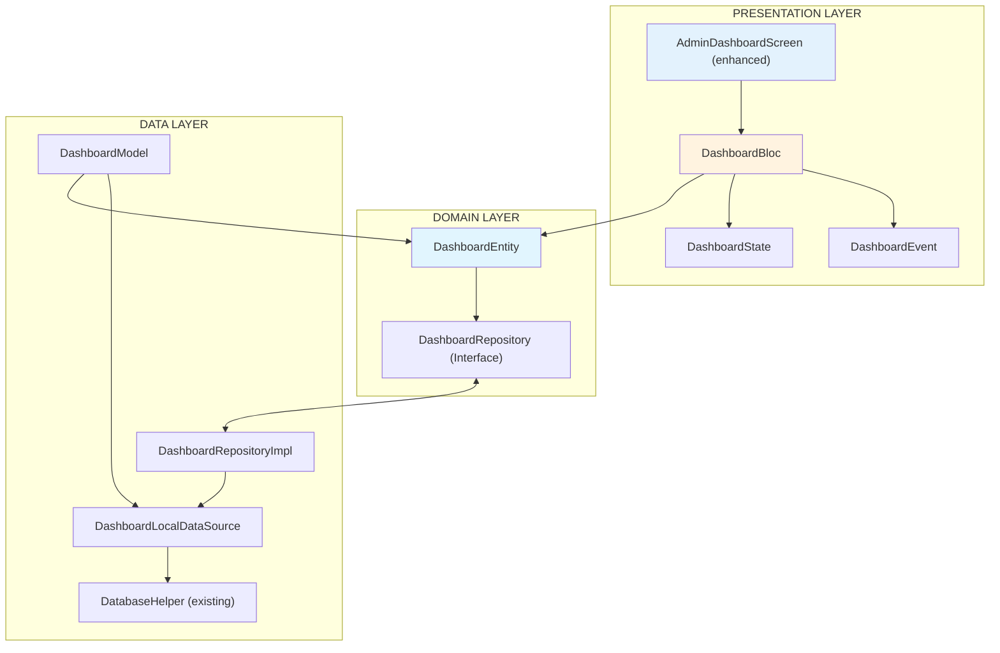
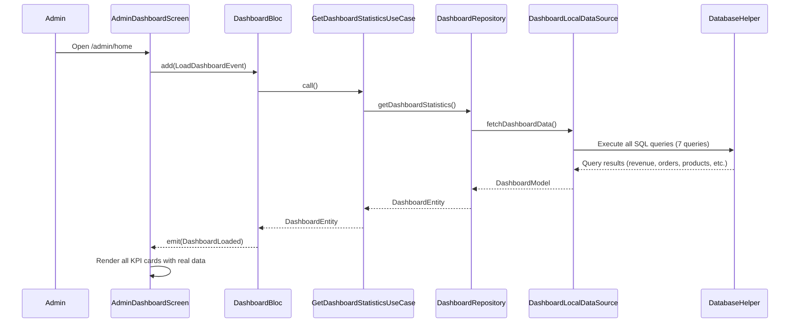

# IEEE Use Case Specification - Admin Dashboard Feature
*(Based on IEEE 830 & Agile Best Practices)*

---

## 1. Feature Overview

|| UC-ID | Feature Name | Actor | Description | Trigger |
||-------|--------------|-------|-------------|---------|
| **UC-DB-01** | View Dashboard Statistics | Admin | Display real-time KPI cards: revenue, orders, products, customers | Admin lands on home screen |
| **UC-DB-02** | View Revenue Analytics | Admin | Display revenue breakdown by time period (today, this week, this month) | Dashboard loads |
| **UC-DB-03** | View Order Status Breakdown | Admin | Display order counts by status (pending, processing, completed, canceled) | Dashboard loads |
| **UC-DB-04** | View Top Selling Products | Admin | Display top 5 best-selling products by quantity sold | Dashboard loads |
| **UC-DB-05** | View Recent Orders | Admin | Display latest 5 orders with status and customer info | Dashboard loads |
| **UC-DB-06** | View Low Stock Alerts | Admin | Display products with stock below threshold (threshold = 10) | Dashboard loads |
| **UC-DB-07** | Refresh Dashboard | Admin | Pull-to-refresh to reload all dashboard metrics | Admin pulls down on scroll |

---

## 2. Architecture Analysis

### 2.1 Current Implementation Status

The existing `admin_home_screen.dart` already provides a dashboard UI skeleton
with the following components:

- Revenue summary card
- Stats grid (total revenue, chats, new orders, inventory, customers)
- Weekly sales bar chart
- Recent activities list

**Problem:** All data is hardcoded (mock data). This specification replaces mock
data with real queries from the existing SQLite database.

### 2.2 Technical Stack

|| Layer | Technology | Purpose |
||-------|------------|---------|
| State Management | **flutter_bloc** | BLoC pattern for reactive UI |
| Dependency Injection | **get_it** | Service locator |
| Local Database | **sqflite** | SQLite for local data |
| Functional Programming | **dartz** | Either for error handling |

### 2.3 Architecture Layers



### 2.4 Data Sources from Existing Database

All data is sourced from the existing SQLite database (`otis_v1.0.1.db`) without
any schema changes. The following tables are queried:

| Table | Used For |
|-------|----------|
| `orders` | Revenue totals, order counts, order statuses |
| `payments` | Payment status and amounts |
| `products` | Product count, stock levels, top sellers |
| `users` | Customer count |
| `order_items` | Quantity sold per product |
| `brands` | Brand-level analytics |
| `chat_rooms` / `messages` | Unread chat count |

---

## 3. Database Query Specifications

### 3.1 Revenue Queries

```
-- Today's revenue (orders with status != 'canceled')
SELECT COALESCE(SUM(total_amount), 0)
FROM orders
WHERE status != 'canceled'
  AND DATE(created_at) = DATE('now', 'localtime')

-- This month's revenue
SELECT COALESCE(SUM(total_amount), 0)
FROM orders
WHERE status != 'canceled'
  AND strftime('%Y-%m', created_at) = strftime('%Y-%m', 'now', 'localtime')

-- Total revenue (all time)
SELECT COALESCE(SUM(total_amount), 0)
FROM orders
WHERE status != 'canceled'
```

### 3.2 Order Count Queries

```
-- Orders by status
SELECT status, COUNT(*) as count
FROM orders
GROUP BY status

-- Today's new orders
SELECT COUNT(*)
FROM orders
WHERE DATE(created_at) = DATE('now', 'localtime')
```

### 3.3 Product Queries

```
-- Total active products
SELECT COUNT(*)
FROM products
WHERE is_active = 1

-- Low stock products (stock < 10)
SELECT p.product_id, p.name, p.stock_quantity, b.name as brand_name
FROM products p
LEFT JOIN brands b ON b.brand_id = p.brand_id
WHERE p.stock_quantity < 10 AND p.is_active = 1
ORDER BY p.stock_quantity ASC
LIMIT 5
```

### 3.4 Customer Query

```
-- Total customers (role_name = 'customer')
SELECT COUNT(*)
FROM users u
INNER JOIN user_roles r ON r.role_id = u.role_id
WHERE r.role_name = 'customer'
```

### 3.5 Top Selling Products Query

```
-- Top 5 best-selling products by total quantity ordered
SELECT p.product_id, p.name, p.image_url, p.price,
       SUM(oi.quantity) as total_sold,
       b.name as brand_name
FROM order_items oi
INNER JOIN products p ON p.product_id = oi.product_id
LEFT JOIN brands b ON b.brand_id = p.brand_id
INNER JOIN orders o ON o.order_id = oi.order_id
WHERE o.status NOT IN ('canceled')
GROUP BY p.product_id
ORDER BY total_sold DESC
LIMIT 5
```

### 3.6 Recent Orders Query

```
-- Latest 5 orders with user info
SELECT o.order_id, o.code, o.total_amount, o.status, o.created_at,
       u.full_name, u.phone
FROM orders o
INNER JOIN users u ON u.user_id = o.user_id
ORDER BY o.created_at DESC
LIMIT 5
```

### 3.7 Weekly Revenue Query

```
-- Revenue grouped by day for the last 7 days
SELECT
  DATE(created_at) as day,
  COALESCE(SUM(total_amount), 0) as revenue
FROM orders
WHERE status NOT IN ('canceled')
  AND created_at >= DATE('now', '-6 days', 'localtime')
GROUP BY DATE(created_at)
ORDER BY day ASC
```

---

## 4. Dashboard Entity & Model

### 4.1 DashboardEntity

```dart
@immutable
@freezed
class DashboardEntity with _$DashboardEntity {
  const factory DashboardEntity({
    required double todayRevenue,
    required double monthRevenue,
    required double totalRevenue,
    required int totalCustomers,
    required int totalProducts,
    required int lowStockCount,
    required int todayNewOrders,
    required OrderStatusBreakdown orderStatusBreakdown,
    required List<TopSellingProduct> topSellingProducts,
    required List<RecentOrder> recentOrders,
    required List<LowStockProduct> lowStockProducts,
    required List<DailyRevenue> weeklyRevenue,
    required DateTime lastUpdated,
  }) = _DashboardEntity;
}
```

### 4.2 Supporting Entities

```dart
@immutable
@freezed
class OrderStatusBreakdown with _$OrderStatusBreakdown {
  const factory OrderStatusBreakdown({
    required int pendingPayment,
    required int paid,
    required int processing,
    required int shipping,
    required int completed,
    required int canceled,
  }) = _OrderStatusBreakdown;
}

@immutable
@freezed
class TopSellingProduct with _$TopSellingProduct {
  const factory TopSellingProduct({
    required String productId,
    required String name,
    required String imageUrl,
    required double price,
    required int totalSold,
    required String brandName,
  }) = _TopSellingProduct;
}

@immutable
@freezed
class RecentOrder with _$RecentOrder {
  const factory RecentOrder({
    required String orderId,
    required String code,
    required double totalAmount,
    required OrderStatus status,
    required DateTime createdAt,
    required String customerName,
    required String customerPhone,
  }) = _RecentOrder;
}

@immutable
@freezed
class LowStockProduct with _$LowStockProduct {
  const factory LowStockProduct({
    required String productId,
    required String name,
    required int stockQuantity,
    required String brandName,
  }) = _LowStockProduct;
}

@immutable
@freezed
class DailyRevenue with _$DailyRevenue {
  const factory DailyRevenue({
    required DateTime day,
    required double revenue,
  }) = _DailyRevenue;
}
```

### 4.3 DashboardModel

```dart
@JsonSerializable(includeIfNull: false)
class DashboardModel extends Equatable {
  const DashboardModel({
    required this.todayRevenue,
    required this.monthRevenue,
    required this.totalRevenue,
    required this.totalCustomers,
    required this.totalProducts,
    required this.lowStockCount,
    required this.todayNewOrders,
    required this.orderStatusBreakdown,
    required this.topSellingProducts,
    required this.recentOrders,
    required this.lowStockProducts,
    required this.weeklyRevenue,
    required this.lastUpdated,
  });

  factory DashboardModel.fromJson(Map<String, dynamic> json) =>
      _$DashboardModelFromJson(json);

  Map<String, dynamic> toJson() => _$DashboardModelToJson(this);

  DashboardEntity toDomain() => DashboardEntity(...);
  factory DashboardModel.fromDomain(DashboardEntity entity) => DashboardModel(...);
}
```

---

## 5. Repository Specification

### 5.1 Repository Interface

```dart
abstract class DashboardRepository {
  /// Fetches all dashboard statistics from local SQLite database.
  /// Returns either a Failure or the DashboardEntity.
  Future<Either<Failure, DashboardEntity>> getDashboardStatistics();
}
```

### 5.2 Implementation

```dart
class DashboardRepositoryImpl implements DashboardRepository {
  final DashboardLocalDataSource localDataSource;

  @override
  Future<Either<Failure, DashboardEntity>> getDashboardStatistics() async {
    try {
      final dashboard = await localDataSource.fetchDashboardData();
      return Right(dashboard.toDomain());
    } on CacheException catch (e) {
      return Left(CacheFailure(e.message));
    } catch (e) {
      return Left(CacheFailure(e.toString()));
    }
  }
}
```

---

## 6. BLoC Specification

### 6.1 Events

```dart
abstract class DashboardEvent extends Equatable {}

class LoadDashboardEvent extends DashboardEvent {}

class RefreshDashboardEvent extends DashboardEvent {}
```

### 6.2 States

```dart
abstract class DashboardState extends Equatable {}

class DashboardInitial extends DashboardState {}

class DashboardLoading extends DashboardState {}

class DashboardLoaded extends DashboardState {
  final DashboardEntity dashboard;

  DashboardLoaded({required this.dashboard});
}

class DashboardError extends DashboardState {
  final String message;

  DashboardError({required this.message});
}
```

### 6.3 BLoC Logic

```dart
class DashboardBloc extends Bloc<DashboardEvent, DashboardState> {
  final GetDashboardStatisticsUseCase getDashboardUseCase;

  DashboardBloc({required this.getDashboardUseCase})
      : super(DashboardInitial()) {
    on<LoadDashboardEvent>(_onLoadDashboard);
    on<RefreshDashboardEvent>(_onRefreshDashboard);
  }

  Future<void> _onLoadDashboard(
    LoadDashboardEvent event,
    Emitter<DashboardState> emit,
  ) async {
    emit(DashboardLoading());
    final result = await getDashboardUseCase();
    result.fold(
      (failure) => emit(DashboardError(message: failure.message)),
      (dashboard) => emit(DashboardLoaded(dashboard: dashboard)),
    );
  }
}
```

---

## 7. Use Case Specification

### UC-DB-01: View Dashboard Statistics

- **ID:** UC-DB-01
- **Name:** View Dashboard Statistics
- **Actor:** Admin
- **Description:** Fetch and display all dashboard KPI metrics from the local SQLite database
- **Trigger:** Admin navigates to `/admin/home` route

#### 7.1.1 Pre-conditions
- Admin is authenticated and has admin role
- SQLite database is accessible
- All required tables have data

#### 7.1.2 Post-conditions
- Dashboard screen shows real KPI cards
- All metrics are populated from database
- Loading skeleton shown during fetch
- Error state with retry button on failure

#### 7.1.3 Normal Flow



#### 7.1.4 Exception Flows

| Exception | Condition | Response |
|-----------|-----------|----------|
| **E1: Database Error** | SQLite query fails | Show error snackbar, display cached data if available |
| **E2: Empty Data** | All tables are empty | Show zero values on all cards with empty state message |
| **E3: Partial Data** | Some queries succeed, some fail | Show successful data, gray out failed sections |

#### 7.1.5 Business Rules
- Revenue excludes canceled orders (`status != 'canceled'`)
- Low stock threshold is 10 units
- Top selling products ordered by `SUM(quantity)` DESC
- Recent orders limited to 5 most recent
- Weekly revenue shows last 7 days including today (fill missing days with 0)
- All monetary values formatted as VND currency

#### 7.1.6 UI/UX Requirements

**KPI Cards Layout (top section):**

```
+------------------------------------------+
|  Today's Revenue Card (full width)       |
|  [Currency] [Amount]   [Live badge]      |
+------------------------------------------+
|  [Total Rev] | [Month Rev] | [Orders]    |
+------------------------------------------+
|  [Products]  | [Customers] | [Low Stock] |
+------------------------------------------+
```

**Middle Section:**
```
+------------------------------------------+
|  Weekly Sales Bar Chart                  |
|  [Mon][Tue][Wed][Thu][Fri][Sat][Sun]   |
+------------------------------------------+
```

**Bottom Section:**
```
+------------------------------------------+
|  Top Selling Products (horizontal list)   |
+------------------------------------------+
|  Recent Orders (vertical list)            |
+------------------------------------------+
```

---

## 8. File Structure

```
lib/
+-- domain/
|   +-- entities/
|   |   +-- dashboard_entity.dart           # NEW: Freezed entity
|   +-- repositories/
|       +-- dashboard_repository.dart       # NEW: Interface
+-- data/
|   +-- models/
|   |   +-- dashboard_model.dart           # NEW: JSON serializable model
|   +-- datasources/
|   |   +-- dashboard/
|   |       +-- dashboard_local_datasource.dart  # NEW
|   |       +-- dashboard_local_datasource_impl.dart  # NEW
|   +-- repositories/
|       +-- dashboard_repository_impl.dart  # NEW
+-- domain/
|   +-- usecases/
|       +-- dashboard/
|           +-- get_dashboard_statistics_usecase.dart  # NEW
+-- presentation/
    +-- bloc/
    |   +-- dashboard/
    |   |   +-- dashboard_bloc.dart     # NEW
    |   |   +-- dashboard_event.dart    # NEW
    |   |   +-- dashboard_state.dart    # NEW
    +-- screens/
        +-- admin/
            +-- admin_home_screen.dart  # MODIFY: Replace mock data with BLoC
```

---

## 9. Dependency Injection Registration

The following registrations must be added to `injection_container.dart`:

```dart
// Dashboard
import 'dashboard/dashboard_local_datasource.dart';
import 'dashboard/dashboard_local_datasource_impl.dart';
import 'dashboard_repository_impl.dart';
import 'dashboard_repository.dart';
import 'dashboard/get_dashboard_statistics_usecase.dart';
import 'dashboard_bloc.dart';

// In init():
// Data sources
sl.registerLazySingleton<DashboardLocalDataSource>(
  () => DashboardLocalDataSourceImpl(sl()),
);

// Repository
sl.registerLazySingleton<DashboardRepository>(
  () => DashboardRepositoryImpl(sl()),
);

// Use cases
sl.registerFactory(() => GetDashboardStatisticsUseCase(sl()));

// BLoC
sl.registerFactory(() => DashboardBloc(getDashboardUseCase: sl()));
```

---

## 10. Navigation

The dashboard is the home screen of the Admin ShellRoute at `/admin/home`.
No new routes need to be added. The existing `AdminLayout` provides the
bottom navigation bar with the following tabs:

| Tab Index | Tab Name | Route |
|-----------|----------|-------|
| 0 | Home | `/admin/home` (Dashboard) |
| 1 | Orders | `/admin/orders` |
| 2 | Products | `/admin/products` |
| 3 | Categories | `/admin/categories` |
| 4 | Settings | `/admin/settings` (future) |

---

## 11. Summary Checklist

| Item | Status | Priority |
|------|--------|----------|
| DashboardEntity (freezed) | To implement | Required |
| DashboardModel | To implement | Required |
| DashboardRepository Interface | To implement | Required |
| DashboardRepositoryImpl | To implement | Required |
| DashboardLocalDataSourceImpl | To implement | Required |
| GetDashboardStatisticsUseCase | To implement | Required |
| DashboardBloc | To implement | Required |
| Wire into injection_container.dart | To implement | Required |
| Enhance admin_home_screen.dart | To implement | Required |

---

## 12. Implementation Priorities

### Priority 1 (MVP - Core Dashboard)
1. DashboardEntity + DashboardModel
2. DashboardLocalDataSourceImpl with all 7 SQL queries
3. DashboardRepositoryImpl
4. GetDashboardStatisticsUseCase
5. DashboardBloc (event, state, bloc)
6. Wire into injection_container.dart
7. Enhance admin_home_screen.dart with BLoC integration

### Priority 2 (Enhanced UI)
- Replace mock "Revenue Card" with real today/month/total revenue
- Replace mock "Stats Grid" with real counts
- Replace mock "Weekly Sales" chart with real weekly data
- Replace mock "Recent Activities" with real recent orders
- Add top selling products horizontal list
- Add low stock alerts section
- Add pull-to-refresh

---

*Document Version: 1.0*
*Last Updated: March 24, 2026*
*Based on: IEEE 830-1998 & Existing Project Patterns*
