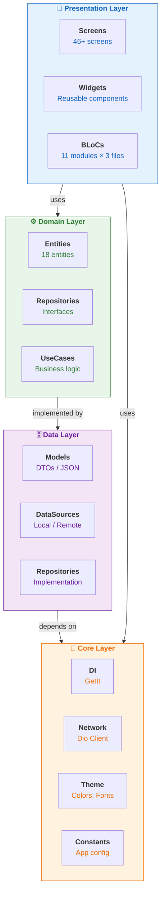
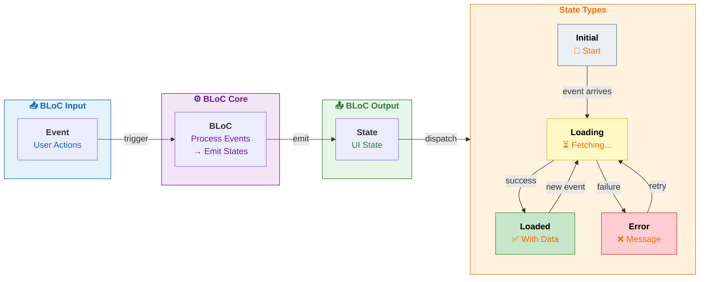
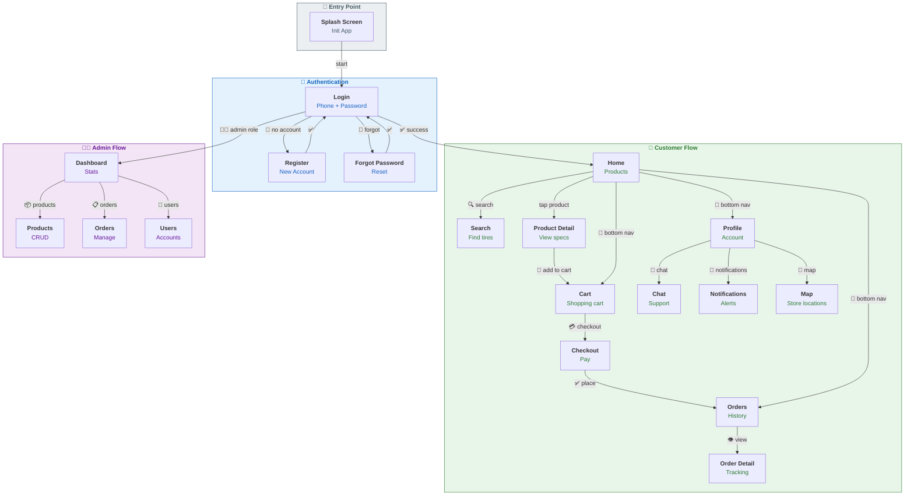
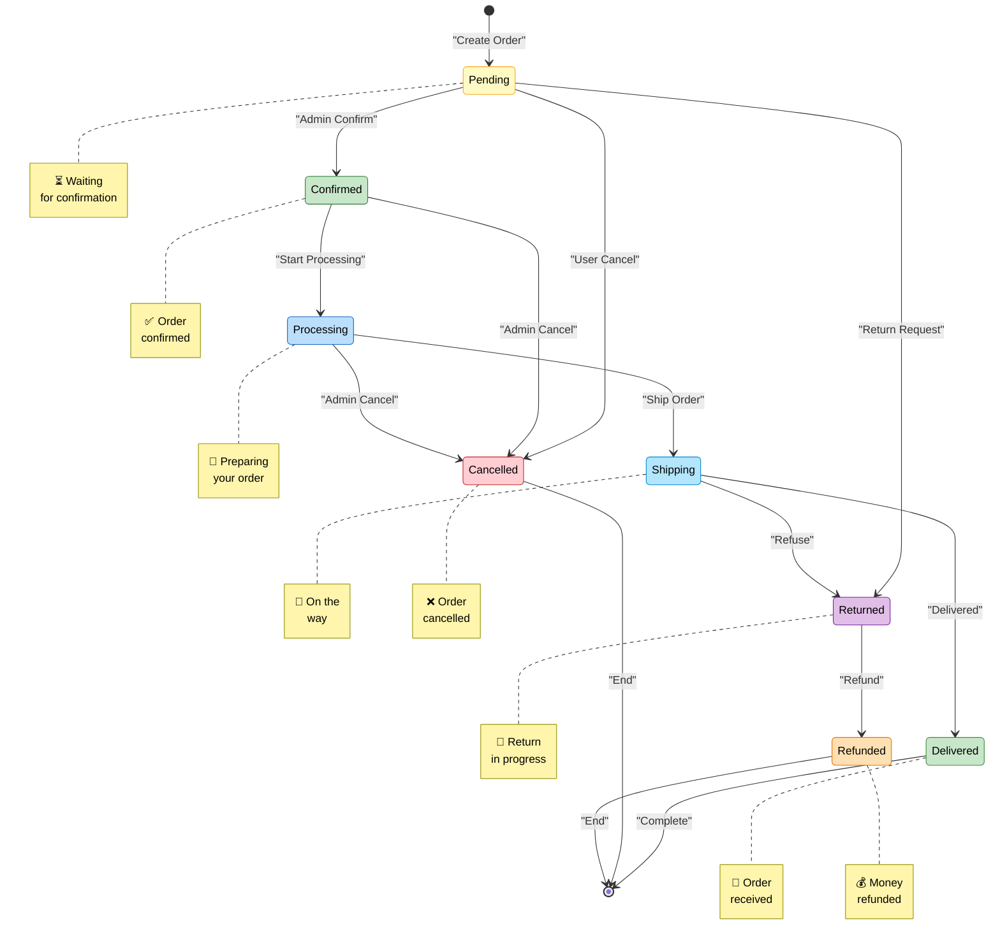
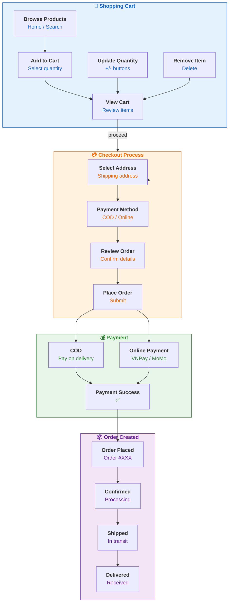
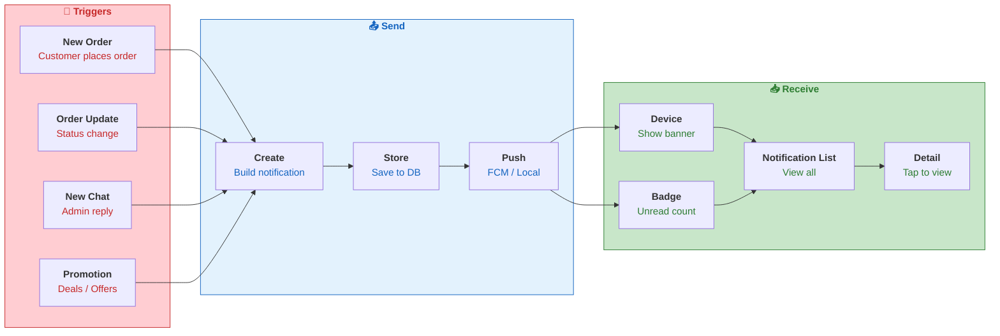
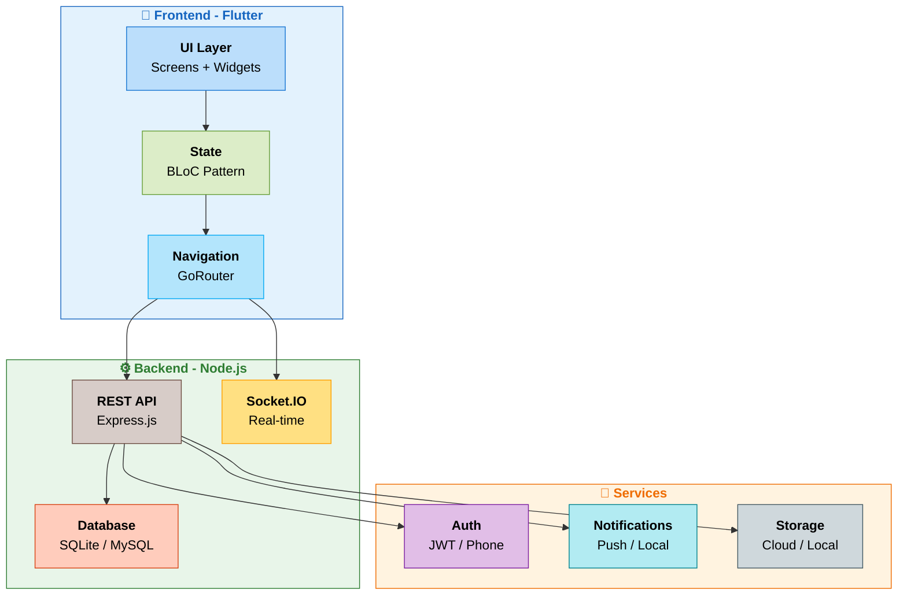
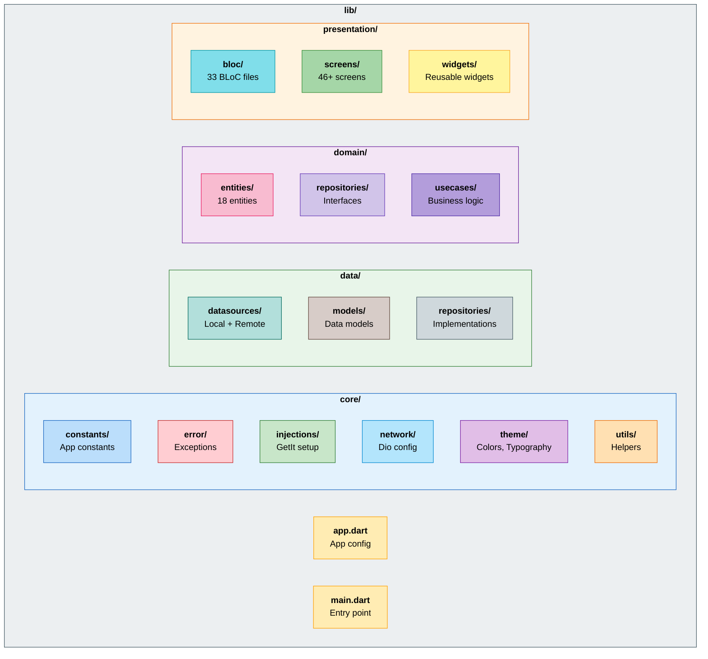
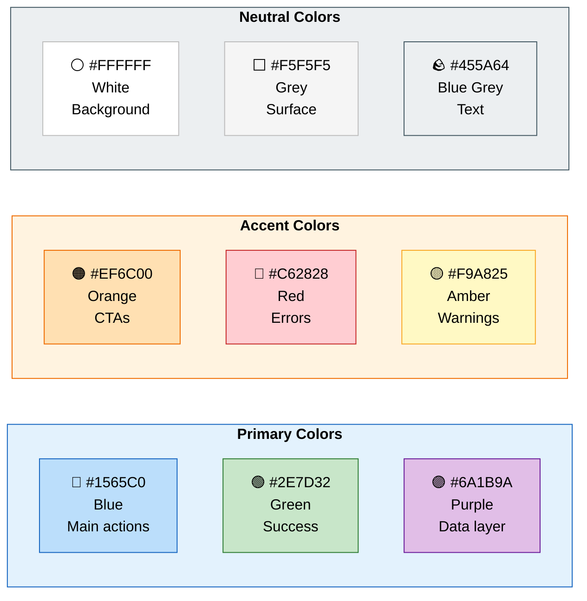

# OTIS Project - System Diagrams

> This file contains all Mermaid diagrams for the OTIS project.
> View this file on GitHub, VS Code (with Mermaid extension), or any Markdown viewer that supports Mermaid.

---

## 1. System Architecture Diagram



---

## 2. Data Flow Diagram

```mermaid
sequenceDiagram
    participant User as "<b>👤 User</b>"
    participant Screen as "<b>📄 Screen</b>"
    participant BLoC as "<b>⚡ BLoC</b>"
    participant UseCase as "<b>🎯 UseCase</b>"
    participant Repository as "<b>📦 Repository</b>"
    participant DataSource as "<b>💾 DataSource</b>"
    participant Database as "<b>🗄️ SQLite</b>"
    
    User->>Screen: 1️⃣ User Interaction
    Screen->>BLoC: 2️⃣ Emit Event
    BLoC->>UseCase: 3️⃣ Execute UseCase
    UseCase->>Repository: 4️⃣ Call Repository
    
    Repository->>DataSource: 5️⃣ Fetch/Save Data
    DataSource->>Database: 6️⃣ SQLite Query
    Database-->>DataSource: 7️⃣ Return Results
    
    DataSource-->>Repository: 8️⃣ Return Model
    Repository-->>UseCase: 9️⃣ Return Entity
    UseCase-->>BLoC: 🔟 Return Result
    BLoC-->>Screen: 1️⃣1️⃣ Emit State
    Screen-->>User: 1️⃣2️⃣ UI Update
    
    style User fill:#E3F2FD,stroke:#1565C0,color:#000
    style Screen fill:#FFF8E1,stroke:#F9A825,color:#000
    style BLoC fill:#E8F5E9,stroke:#2E7D32,color:#000
    style UseCase fill:#F3E5F5,stroke:#6A1B9A,color:#000
    style Repository fill:#FBE9E7,stroke:#BF360C,color:#000
    style DataSource fill:#E0F7FA,stroke:#00838F,color:#000
    style Database fill:#F1F8E9,stroke:#558B2F,color:#000
```

---

## 3. Entity Relationship Diagram (ERD)

```mermaid
erDiagram
    USER_ROLES ||--o{ USERS : "defines role"
        {
            role_id : int PK
            role_name : string
        }
    
    USERS ||--o{ CART_ITEMS : "adds items"
    USERS ||--o{ ORDERS : "places orders"
    USERS ||--o{ NOTIFICATIONS : "receives"
    USERS ||--o{ CHAT_ROOMS : "owns chat"
        {
            user_id : int PK
            phone : string UK
            password_hash : string
            full_name : string
            address : string
            shop_name : string
            avatar_url : string
            role_id : int FK
            status : string
            created_at : timestamp
        }
    
    BRANDS ||--o{ PRODUCTS : "manufactures"
        {
            brand_id : int PK
            name : string UK
            logo_url : string
        }
    
    TIRE_SPECS ||--o{ PRODUCTS : "specifies"
        {
            tire_spec_id : int PK
            width : int
            aspect_ratio : int
            rim_diameter : int
        }
    
    VEHICLE_MAKES ||--o{ PRODUCTS : "fits vehicle"
        {
            make_id : int PK
            name : string UK
            logo_url : string
        }
    
    PRODUCTS ||--o{ CART_ITEMS : "in cart"
    PRODUCTS ||--o{ ORDER_ITEMS : "ordered"
        {
            product_id : int PK
            sku : string UK
            name : string
            image_url : string
            brand_id : int FK
            make_id : int FK
            tire_spec_id : int FK
            price : decimal
            stock_quantity : int
            is_active : bool
            created_at : timestamp
        }
    
    ORDERS ||--o{ ORDER_ITEMS : "contains"
        {
            order_id : int PK
            code : string UK
            total_amount : decimal
            status : string
            shipping_address : string
            user_id : int FK
            created_at : timestamp
        }
    
    CHAT_ROOMS ||--o{ MESSAGES : "contains messages"
        {
            room_id : int PK
            user_id : int FK
            status : string
        }
    
    NOTIFICATIONS {
        notification_id : int PK
        title : string
        body : string
        is_read : bool
        user_id : int FK
        created_at : timestamp
    }
    
    ORDER_ITEMS {
        order_item_id : int PK
        order_id : int FK
        product_id : int FK
        quantity : int
        unit_price : decimal
    }
    
    CART_ITEMS {
        cart_item_id : int PK
        user_id : int FK
        product_id : int FK
        quantity : int
    }
    
    MESSAGES {
        message_id : int PK
        room_id : int FK
        sender_id : int FK
        content : string
        image_url : string
        is_read : bool
        created_at : timestamp
    }
    
    style USER_ROLES fill:#FFCDD2,stroke:#C62828,color:#000
    style USERS fill:#FFCDD2,stroke:#C62828,color:#000
    style BRANDS fill:#C8E6C9,stroke:#2E7D32,color:#000
    style TIRE_SPECS fill:#C8E6C9,stroke:#2E7D32,color:#000
    style VEHICLE_MAKES fill:#C8E6C9,stroke:#2E7D32,color:#000
    style PRODUCTS fill:#FFF9C4,stroke:#F9A825,color:#000
    style ORDERS fill:#BBDEFB,stroke:#1565C0,color:#000
    style CART_ITEMS fill:#E1BEE7,stroke:#7B1FA2,color:#000
    style ORDER_ITEMS fill:#BBDEFB,stroke:#1565C0,color:#000
    style CHAT_ROOMS fill:#B2DFDB,stroke:#00695C,color:#000
    style MESSAGES fill:#B2DFDB,stroke:#00695C,color:#000
    style NOTIFICATIONS fill:#D7CCC8,stroke:#5D4037,color:#000
```

---

## 4. BLoC State Management Pattern



---

## 5. Navigation Flow Diagram



---

## 6. Order Status State Machine



---

## 7. Cart & Checkout Flow



---

## 8. Real-time Chat Flow (Socket.IO)

```mermaid
sequenceDiagram
    participant Customer as "<b>👤 Customer</b>"
    participant App as "<b>📱 OTIS App</b>"
    participant Socket as "<b>🔌 Socket.IO</b>"
    participant Server as "<b>🖥️ Server</b>"
    participant Admin as "<b>👨‍💼 Admin</b>"
    
    Customer->>App: 1️⃣ Open Chat
    App->>Socket: 2️⃣ Connect
    Socket->>Server: 3️⃣ Create/Get Room
    Server-->>Socket: 4️⃣ Room ID
    Socket-->>App: 5️⃣ Join Success
    
    Customer->>App: 6️⃣ Type Message
    App->>Socket: 7️⃣ Emit 'message'
    Socket->>Server: 8️⃣ Send
    Server->>Server: 9️⃣ Save to DB
    
    Server-->>Socket: 🔟 Broadcast
    Socket-->>App: 1️⃣1️⃣ Receive
    App-->>Customer: 1️⃣2️⃣ Display
    Socket-->>Admin: 1️⃣3️⃣ Notify Admin
    
    Admin->>Socket: 1️⃣4️⃣ Reply
    Socket-->>Server: 1️⃣5️⃣ Send
    Server-->>Socket: 1️⃣6️⃣ Broadcast
    Socket-->>App: 1️⃣7️⃣ Receive
    App-->>Customer: 1️⃣8️⃣ Show Reply
    
    Customer->>App: 1️⃣9️⃣ Close Chat
    App->>Socket: 2️⃣0️⃣ Disconnect
    
    style Customer fill:#E3F2FD,stroke:#1565C0,color:#000
    style App fill:#E8F5E9,stroke:#2E7D32,color:#000
    style Socket fill:#FFF9C4,stroke:#F9A825,color:#000
    style Server fill:#F3E5F5,stroke:#6A1B9A,color:#000
    style Admin fill:#FFE0B2,stroke:#EF6C00,color:#000
```

---

## 9. Notification Flow



---

## 10. Technology Stack Diagram



---

## 11. Project Directory Structure



---

## 12. Color Palette Reference



---

**Report Generated:** March 2026  
**Team:** PRM393 Group 1 - OTIS Project
