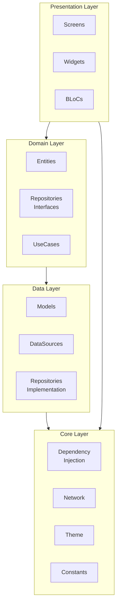
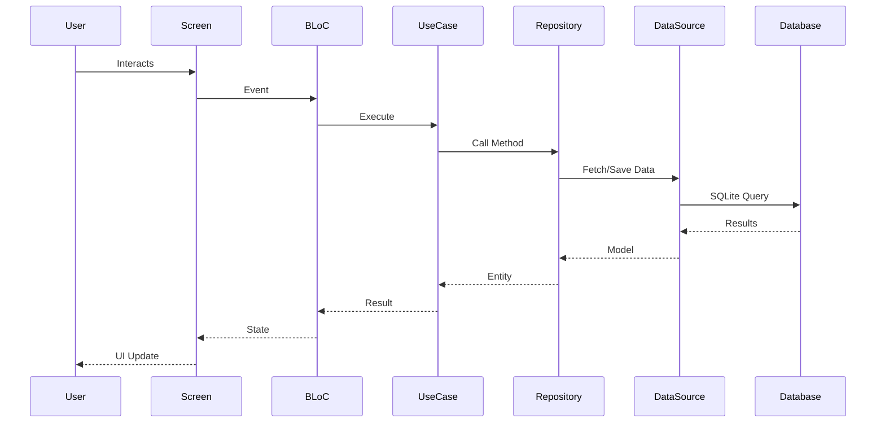
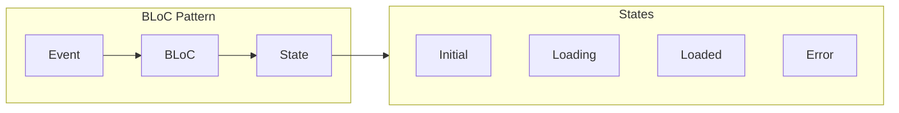
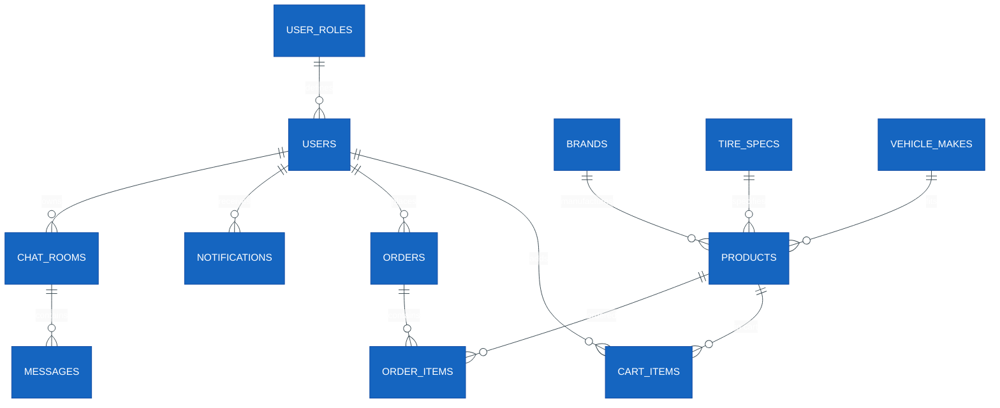
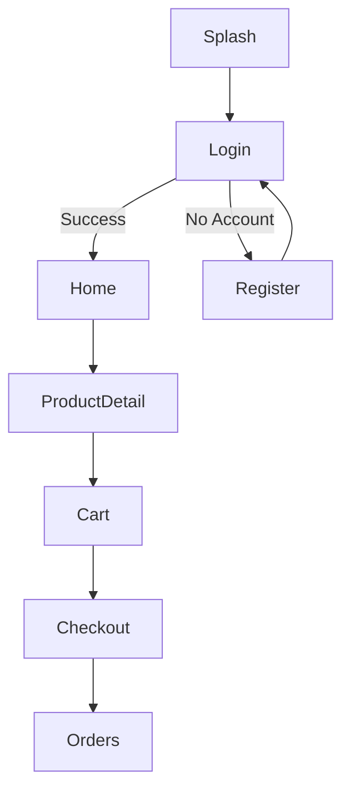

# OTIS (Online Tires Inventory & Sales) - Final Technical Report

**Course:** PRM393 - Mobile Application Development (Flutter)
**Project:** 30% of Course Grade
**Team:** PRM393 Group 1
**Academic Year:** 2025-2026

---

## Table of Contents

1. Team Introduction
2. Case Study: OTIS
3. Business Analysis & System Design
4. System Architecture
5. Database Design
6. Feature Modules
7. Technical Specifications
8. UI/UX Design
9. Testing
10. Conclusion and Discussion
11. Contribution Matrix

---

## 1. Team Introduction

### Team Members

| No | Name                               | Role                                | Contributions                                        |
| -- | ---------------------------------- | ----------------------------------- | ---------------------------------------------------- |
| 1  | **Nguy Tan Huy** (Leader)    | Pool ideas, give assignments, coder | Authentication Function, Category Management         |
| 2  | **Duong Minh Kiet** (Member) | Coder, tester, give ideas           | Home Page, Product Management                        |
| 3  | **Tang Thanh Vui** (Member)  | Coder, tester, give ideas           | Cart Management, Order Management                    |
| 4  | **Dong Minh Quang** (Member) | Coder, tester, give ideas           | User Management, Chat Management, Profile Management |
| 5  | **Tran Minh That** (Member)  | Coder, tester, give ideas           | Map Management, Notification Management              |

### Team Collaboration

The OTIS project team follows Agile methodology with weekly sprints. Each member is responsible for their assigned modules and participates in code reviews.

---

## 2. Case Study: OTIS

### 2.1 Business Scenario

**OTIS (Online Tires Inventory & Sales)** is a specialized mobile e-commerce platform designed to modernize the tire retail market in Vietnam.

### 2.2 The Problem

| Challenge                       | Description                                                | Impact                 |
| ------------------------------- | ---------------------------------------------------------- | ---------------------- |
| **Physical Inefficiency** | Customers must travel to automotive hubs to compare prices | Time-consuming         |
| **Outdated Methods**      | Small dealers use manual ledger systems                    | No real-time inventory |
| **Information Gap**       | Consumers struggle to verify tire specifications           | Wrong purchases        |

### 2.3 The Solution

- **Browse & Search**: Digital catalog of major brands
- **Mobile-First Accessibility**: Seamless smartphone experience
- **Vehicle-First Filtering**: Smart filter system
- **Direct Engagement**: Simplified purchase path

### 2.4 Key Features

1. Product Catalog: 50+ tire products
2. Smart Search: Filter by brand, vehicle, price, specs
3. Shopping Cart: Add, update, remove items
4. Order Management: Create orders, track status
5. Customer Support: Real-time chat
6. Push Notifications: Order updates
7. Store Locations: Interactive map
8. Admin Dashboard: Full CRUD operations

---

## 3. Business Analysis & System Design

### 3.1 Functional Requirements

| Module       | Function              | Description                     |
| ------------ | --------------------- | ------------------------------- |
| Auth         | Login                 | Phone + password authentication |
| Auth         | Register              | New customer registration       |
| Auth         | Forgot/Reset Password | Password recovery               |
| Product      | List Products         | Browse tires with pagination    |
| Product      | Search Products       | Search by name, brand, specs    |
| Product      | Filter Products       | Filter by brand, vehicle, price |
| Product      | View Details          | Specifications, pricing, stock  |
| Cart         | Add to Cart           | Add products with quantity      |
| Cart         | Update Quantity       | Modify item quantities          |
| Cart         | Remove Items          | Delete from cart                |
| Order        | Create Order          | Convert cart to order           |
| Order        | View History          | List past orders                |
| Order        | Order Details         | View order information          |
| Payment      | Checkout              | Process payments                |
| Chat         | Send Messages         | Real-time support chat          |
| Notification | Receive Notifications | Push notifications              |
| Map          | View Locations        | Display shop locations          |
| Profile      | View/Update Profile   | User account management         |
| Admin        | Dashboard             | Admin statistics                |
| Admin        | Product CRUD          | Full product management         |
| Admin        | Order Management      | Process orders                  |
| Admin        | User Management       | Manage user accounts            |

### 3.2 Non-Functional Requirements

| Requirement     | Description                  |
| --------------- | ---------------------------- |
| Performance     | Load within 3 seconds        |
| Reliability     | SQLite transaction integrity |
| Usability       | Vietnamese language support  |
| Maintainability | Clean Architecture           |
| Scalability     | Modular structure            |
| Offline Support | Core browsing offline        |

### 3.3 New Technologies Used

| Technology         | Purpose              |
| ------------------ | -------------------- |
| Flutter BLoC       | State management     |
| Clean Architecture | Code organization    |
| SQLite (sqflite)   | Local database       |
| Dio                | HTTP client          |
| GoRouter           | Navigation           |
| GetIt              | Dependency Injection |
| Socket.IO          | Real-time chat       |
| Flutter Map        | Map display          |

---

## 4. System Architecture

### 4.1 Architecture Overview

OTIS follows **Clean Architecture** principles with three main layers:



### 4.2 Data Flow



### 4.3 Directory Structure

```
lib/
├── core/
│   ├── constants/
│   ├── error/
│   ├── injections/
│   ├── network/
│   ├── theme/
│   └── utils/
│
├── data/
│   ├── datasources/
│   ├── models/
│   └── repositories/
│
├── domain/
│   ├── entities/     (18 files)
│   ├── repositories/
│   └── usecases/
│
├── presentation/
│   ├── bloc/         (33 BLoC files)
│   ├── screens/      (46+ screens)
│   └── widgets/
│
├── app.dart
└── main.dart
```

### 4.4 BLoC Pattern



---

## 5. Database Design

### 5.1 Entity Relationship Diagram



### 5.2 Database Tables

| Table         | Description           | Sample Data |
| ------------- | --------------------- | ----------- |
| user_roles    | User roles            | 2 roles     |
| users         | User accounts         | 4 users     |
| brands        | Tire brands           | 5 brands    |
| tire_specs    | Tire specifications   | 34 specs    |
| vehicle_makes | Vehicle manufacturers | 5 makes     |
| products      | Tire products         | 50 products |
| cart_items    | Shopping cart         | 5 items     |
| orders        | Customer orders       | 3 orders    |
| order_items   | Order line items      | 6 items     |
| notifications | User notifications    | 4 items     |
| chat_rooms    | Chat rooms            | 3 rooms     |
| messages      | Chat messages         | 6 messages  |

### 5.3 Sample Data Summary

| Category      | Count | Examples                                          |
| ------------- | ----- | ------------------------------------------------- |
| Brands        | 5     | Bridgestone, Michelin, Yokohama, Sailun, Goodride |
| Products      | 50    | Various tire models                               |
| Vehicle Makes | 5     | Toyota, Honda, Mazda, Ford, Hyundai               |
| Tire Specs    | 34    | Width: 145-295mm                                  |

---

## 6. Feature Modules

### 6.1 Authentication Module

- login_screen.dart - Phone/password login
- register_screen.dart - New registration
- forgot_screen.dart - Password recovery
- reset_screen.dart - New password
- change_screen.dart - Password change

### 6.2 Product Module

- home_screen.dart - Product listing
- product_search_screen.dart - Search
- product_detail_screen.dart - Details

### 6.3 Cart Module

- cart_screen.dart - Shopping cart
- checkout_screen.dart - Checkout

### 6.4 Order Module

- order_list_screen.dart - History
- order_detail_screen.dart - Details
- order_tracking_screen.dart - Tracking

### 6.5 Chat Module

- chat_screen.dart - Customer chat
- admin_chat_list_screen.dart - Admin list
- admin_chat_detail_screen.dart - Admin view

### 6.6 Notification Module

- notification_list_screen.dart - List
- notification_detail_screen.dart - Details

### 6.7 Map Module

- map_screen.dart - Shop locations
- shop_locations_map_screen.dart - Full map

### 6.8 Admin Module

- admin_home_screen.dart - Dashboard
- admin_product_list_screen.dart - Products
- admin_orders_screen.dart - Orders
- admin_view_list_user.dart - Users

---

## 7. Technical Specifications

### 7.1 Technology Stack

| Component        | Technology       | Version |
| ---------------- | ---------------- | ------- |
| Framework        | Flutter          | 3.x     |
| Language         | Dart             | 3.10+   |
| State Management | flutter_bloc     | 9.1.1   |
| DI               | get_it           | 9.2.0   |
| HTTP Client      | dio              | 5.9.1   |
| Database         | sqflite          | 2.4.2   |
| Navigation       | go_router        | 17.1.0  |
| Real-time Chat   | socket_io_client | 3.1.4   |
| Maps             | flutter_map      | 7.0.2   |

### 7.2 Key Dependencies

```yaml
dependencies:
  flutter_bloc: ^9.1.1
  equatable: ^2.0.6
  dio: ^5.9.1
  sqflite: ^2.4.2
  get_it: ^9.2.0
  go_router: ^17.1.0
  flutter_secure_storage: ^10.0.0
  socket_io_client: ^3.1.4
  flutter_map: ^7.0.2
  freezed_annotation: ^3.1.0
```

### 7.3 Database Schema

```sql
CREATE TABLE products (
  product_id INTEGER PRIMARY KEY,
  sku TEXT UNIQUE,
  name TEXT,
  image_url TEXT,
  brand_id INTEGER,
  make_id INTEGER,
  tire_spec_id INTEGER,
  price DECIMAL,
  stock_quantity INTEGER,
  is_active INTEGER DEFAULT 1,
  created_at TEXT
);

CREATE TABLE users (
  user_id INTEGER PRIMARY KEY,
  phone TEXT UNIQUE,
  password_hash TEXT,
  full_name TEXT,
  address TEXT,
  role_id INTEGER,
  status TEXT
);

CREATE TABLE orders (
  order_id INTEGER PRIMARY KEY,
  code TEXT UNIQUE,
  total_amount DECIMAL,
  status TEXT,
  shipping_address TEXT,
  user_id INTEGER
);
```

---

## 8. UI/UX Design

### 8.1 Color Palette

| Color      | Hex     | Usage              |
| ---------- | ------- | ------------------ |
| Primary    | #1976D2 | Main actions       |
| Accent     | #FF6F00 | CTAs               |
| Success    | #4CAF50 | Success states     |
| Error      | #F44336 | Errors             |
| Background | #F5F5F5 | Screen backgrounds |

### 8.2 Navigation Flow



---

## 9. Testing

### 9.1 Unit Testing

```dart
void main() {
  test('Product entity validates price', () {
    final product = Product(
      id: '1',
      sku: 'TEST-001',
      name: 'Test Tire',
      imageUrl: '',
      price: 1500000,
      stockQuantity: 10,
      isActive: true,
      createdAt: DateTime.now(),
    );
  
    expect(product.isInStock, true);
    expect(product.formattedPrice.contains('1.500.000'), true);
  });
}
```

### 9.2 Running Tests

```bash
flutter test
flutter test --coverage
```

---

## 10. Conclusion and Discussion

### 10.1 Pros

| Strength            | Description                                |
| ------------------- | ------------------------------------------ |
| Targeted Solution   | Addresses Vietnamese automotive market gap |
| User-Centric Design | Vehicle-first filtering reduces errors     |
| Cross-Platform      | Flutter ensures Android/iOS consistency    |
| Offline Support     | SQLite enables offline browsing            |
| Clean Architecture  | Maintainable and scalable codebase         |

### 10.2 Cons

| Limitation          | Description                       |
| ------------------- | --------------------------------- |
| Data Dependency     | Accuracy depends on tire database |
| Single-Shop Focus   | MVP for single shop entity        |
| Manual Verification | No automated plate recognition    |

### 10.3 Lessons Learned

1. Clean Architecture importance
2. Market-specific localization
3. BLoC state management
4. Team collaboration

### 10.4 Future Improvements

| Feature                   | Priority |
| ------------------------- | -------- |
| AI License Plate Scanning | High     |
| Zalo Integration          | High     |
| Multi-Vendor Support      | Medium   |
| Payment Gateway           | Medium   |

---

## 11. Contribution Matrix

| Topic             | D.Minh Kiet | T.Thanh Vui | D.Minh Quang | N.Tan Huy | T.Minh That |
| ----------------- | ----------- | ----------- | ------------ | --------- | ----------- |
| Case Study        | 20%         | 20%         | 20%          | 20%       | 20%         |
| Business Analysis | 20%         | 20%         | 20%          | 20%       | 20%         |
| System Design     | 20%         | 20%         | 20%          | 20%       | 20%         |
| Implementation    | 20%         | 20%         | 20%          | 20%       | 20%         |
| Documentation     | 20%         | 20%         | 20%          | 20%       | 20%         |

### Individual Contributions

| Member          | Primary Modules     |
| --------------- | ------------------- |
| Nguyen Tan Huy  | Auth, Category      |
| Duong Minh Kiet | Home, Product       |
| Tang Thanh Vui  | Cart, Order         |
| Dong Minh Quang | User, Chat, Profile |
| Tran Minh That  | Map, Notification   |

---

## References

1. Flutter Documentation: https://flutter.dev/docs
2. BLoC Library: https://bloclibrary.dev/
3. Clean Architecture: https://blog.cleancoder.com/uncle-bob/2012/08/13/the-clean-architecture.html

---

**Report Generated:** March 2026
**Project Version:** 1.0.0
**Team:** PRM393 Group 1 - OTIS Project
