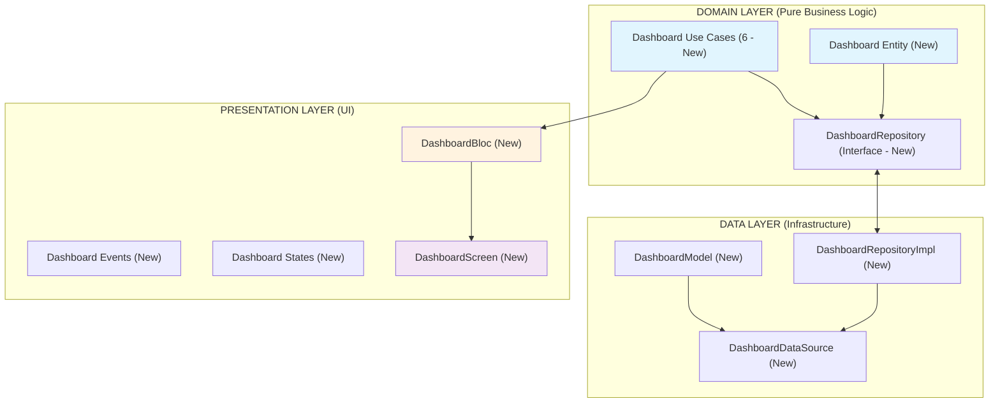
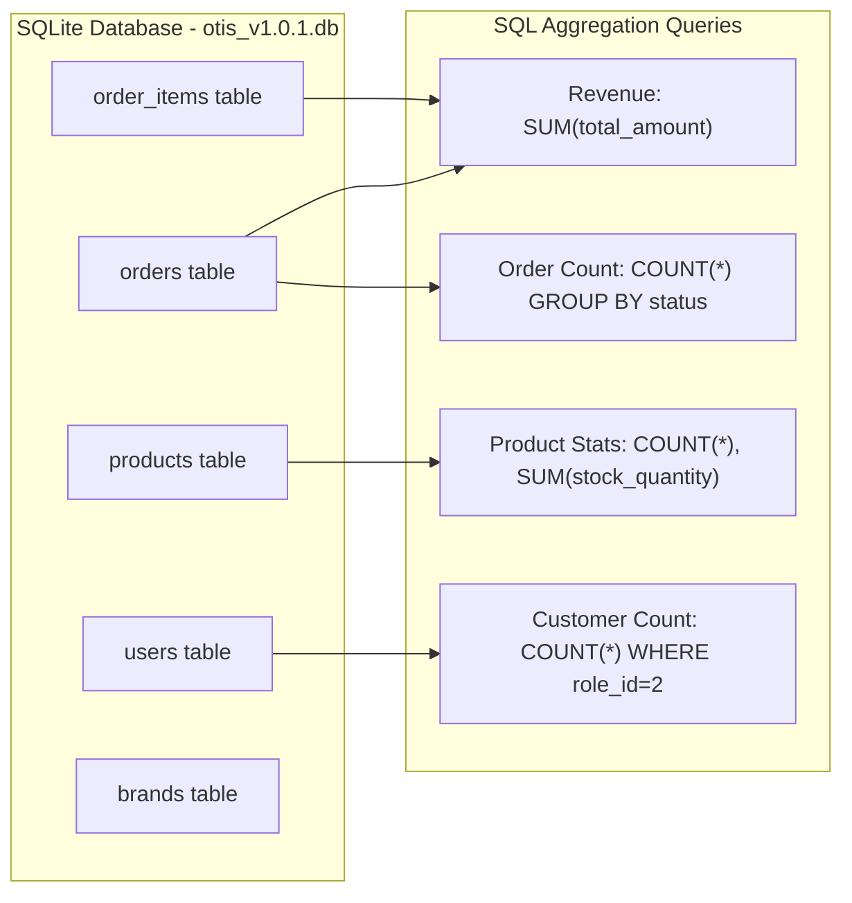
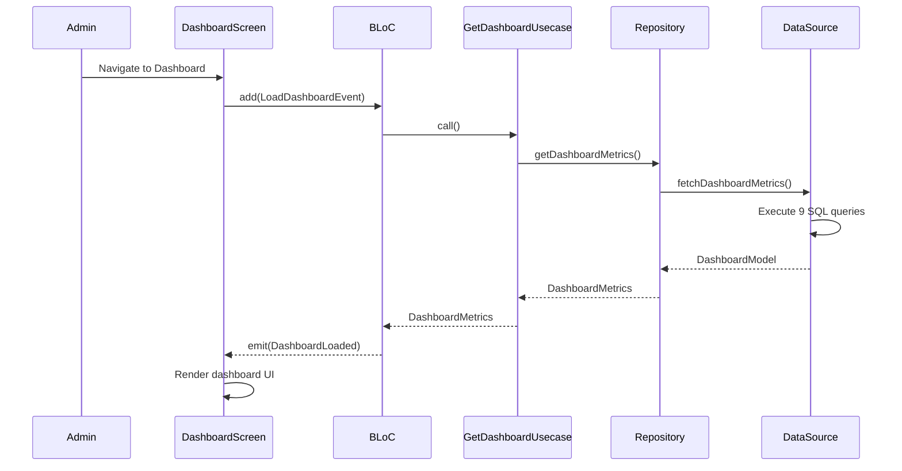
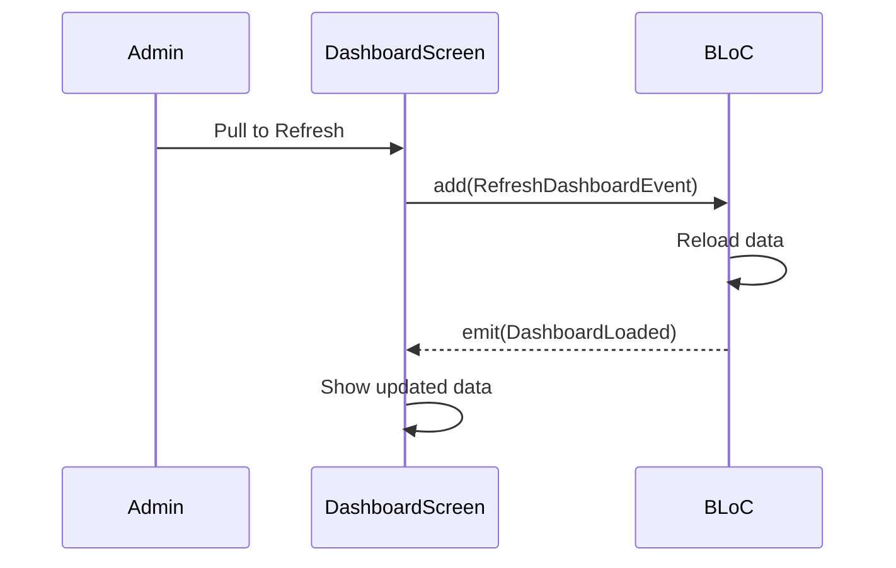
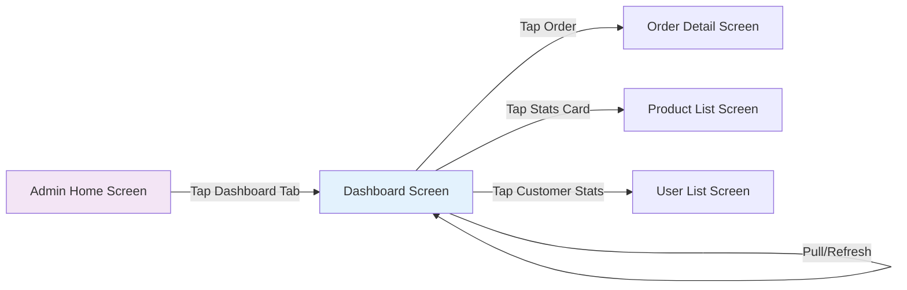

# IEEE Use Case Specification - Admin Dashboard Feature
*(Based on IEEE 830 & Agile Best Practices)*

---

## 1. Feature Overview

| UC-ID | Feature Name | Actor | Description | Trigger |
|-------|--------------|-------|-------------|---------|
| **UC-DB-01** | View Dashboard Overview | Admin | Display summary dashboard with key metrics and charts | Admin navigates to dashboard screen |
| **UC-DB-02** | View Revenue Statistics | Admin | Show total revenue, today's revenue, revenue by period | Auto-loaded on dashboard view |
| **UC-DB-03** | View Order Statistics | Admin | Display order counts by status, recent orders | Auto-loaded on dashboard view |
| **UC-DB-04** | View Product Statistics | Admin | Show product counts, stock levels, top products | Auto-loaded on dashboard view |
| **UC-DB-05** | View Customer Statistics | Admin | Display customer counts, new registrations | Auto-loaded on dashboard view |
| **UC-DB-06** | Refresh Dashboard Data | Admin | Reload all dashboard metrics | User pulls to refresh or taps refresh button |

---

## 2. Architecture Analysis

### 2.1 Current Implementation Status



### 2.2 Data Sources from Existing Database



### 2.3 Technical Stack

| Layer | Technology | Purpose |
|-------|------------|---------|
| State Management | **flutter_bloc** | BLoC pattern for reactive UI |
| Dependency Injection | **get_it** | Service locator |
| Functional Programming | **dartz** | Either for error handling |
| Local Database | **sqflite** | SQLite for data queries |
| UI Components | **fl_chart** | Chart visualization |

---

## 3. Database Query Specifications

### 3.1 Dashboard Metrics SQL Queries

All queries use the existing database schema without modifications.

#### 3.1.1 Total Revenue Query
```sql
SELECT COALESCE(SUM(total_amount), 0) as total_revenue
FROM orders
WHERE status != 'canceled';
```

#### 3.1.2 Today's Revenue Query
```sql
SELECT COALESCE(SUM(total_amount), 0) as today_revenue
FROM orders
WHERE DATE(created_at) = DATE('now', 'localtime')
  AND status != 'canceled';
```

#### 3.1.3 Order Count by Status Query
```sql
SELECT
  COUNT(*) as total_orders,
  SUM(CASE WHEN status = 'pending_payment' THEN 1 ELSE 0 END) as pending,
  SUM(CASE WHEN status = 'processing' THEN 1 ELSE 0 END) as processing,
  SUM(CASE WHEN status = 'shipping' THEN 1 ELSE 0 END) as shipping,
  SUM(CASE WHEN status = 'completed' THEN 1 ELSE 0 END) as completed,
  SUM(CASE WHEN status = 'canceled' THEN 1 ELSE 0 END) as canceled
FROM orders;
```

#### 3.1.4 Product Statistics Query
```sql
SELECT
  COUNT(*) as total_products,
  SUM(CASE WHEN stock_quantity = 0 THEN 1 ELSE 0 END) as out_of_stock,
  SUM(CASE WHEN stock_quantity > 0 AND stock_quantity <= 10 THEN 1 ELSE 0 END) as low_stock,
  SUM(CASE WHEN stock_quantity > 10 THEN 1 ELSE 0 END) as in_stock,
  SUM(stock_quantity) as total_stock
FROM products
WHERE is_active = 1;
```

#### 3.1.5 Customer Statistics Query
```sql
SELECT
  COUNT(*) as total_customers,
  SUM(CASE WHEN DATE(created_at) = DATE('now', 'localtime') THEN 1 ELSE 0 END) as new_today,
  SUM(CASE WHEN created_at >= DATE('now', '-7 days', 'localtime') THEN 1 ELSE 0 END) as new_this_week
FROM users u
INNER JOIN user_roles r ON r.role_id = u.role_id
WHERE r.role_name = 'customer';
```

#### 3.1.6 Recent Orders Query
```sql
SELECT
  o.order_id,
  o.code,
  o.total_amount,
  o.status,
  o.created_at,
  u.full_name
FROM orders o
LEFT JOIN users u ON u.user_id = o.user_id
ORDER BY o.created_at DESC
LIMIT 10;
```

#### 3.1.7 Revenue by Day (Last 7 Days) Query
```sql
SELECT
  DATE(created_at) as date,
  COALESCE(SUM(total_amount), 0) as daily_revenue,
  COUNT(*) as order_count
FROM orders
WHERE created_at >= DATE('now', '-7 days', 'localtime')
  AND status != 'canceled'
GROUP BY DATE(created_at)
ORDER BY date ASC;
```

#### 3.1.8 Top Selling Products Query
```sql
SELECT
  p.product_id,
  p.name,
  p.image_url,
  p.price,
  SUM(oi.quantity) as total_sold,
  COUNT(DISTINCT oi.order_id) as order_count
FROM order_items oi
INNER JOIN products p ON p.product_id = oi.product_id
INNER JOIN orders o ON o.order_id = oi.order_id
WHERE o.status != 'canceled'
GROUP BY p.product_id
ORDER BY total_sold DESC
LIMIT 5;
```

#### 3.1.9 Revenue by Brand Query
```sql
SELECT
  b.name as brand_name,
  COALESCE(SUM(oi.unit_price * oi.quantity), 0) as brand_revenue,
  COUNT(DISTINCT oi.order_id) as order_count
FROM order_items oi
INNER JOIN products p ON p.product_id = oi.product_id
LEFT JOIN brands b ON b.brand_id = p.brand_id
INNER JOIN orders o ON o.order_id = oi.order_id
WHERE o.status != 'canceled'
GROUP BY b.brand_id
ORDER BY brand_revenue DESC;
```

---

## 4. Data Models

### 4.1 Dashboard Entity

```dart
/// Dashboard metrics aggregated from database.
/// Immutable - all values computed at query time.
class DashboardMetrics extends Equatable {
  /// Total revenue from all non-canceled orders
  final double totalRevenue;

  /// Revenue from orders created today
  final double todayRevenue;

  /// Total number of orders
  final int totalOrders;

  /// Orders grouped by status
  final OrderStatusCount orderStatusCount;

  /// Total number of active products
  final int totalProducts;

  /// Products count by stock status
  final ProductStockCount stockCount;

  /// Total number of customers
  final int totalCustomers;

  /// New customers registered today
  final int newCustomersToday;

  /// New customers registered this week
  final int newCustomersThisWeek;

  /// List of recent orders
  final List<RecentOrder> recentOrders;

  /// Revenue data for last 7 days
  final List<DailyRevenue> weeklyRevenue;

  /// Top selling products
  final List<TopProduct> topProducts;

  /// Revenue by brand
  final List<BrandRevenue> brandRevenue;

  /// When this data was fetched
  final DateTime fetchedAt;
}
```

### 4.2 Supporting Data Classes

```dart
class OrderStatusCount extends Equatable {
  final int pending;
  final int processing;
  final int shipping;
  final int completed;
  final int canceled;

  int get total => pending + processing + shipping + completed + canceled;
}

class ProductStockCount extends Equatable {
  final int inStock;
  final int lowStock;
  final int outOfStock;
  final int totalStock;
}

class RecentOrder extends Equatable {
  final String orderId;
  final String code;
  final double totalAmount;
  final String status;
  final DateTime createdAt;
  final String? customerName;
}

class DailyRevenue extends Equatable {
  final DateTime date;
  final double revenue;
  final int orderCount;
}

class TopProduct extends Equatable {
  final String productId;
  final String name;
  final String imageUrl;
  final double price;
  final int totalSold;
  final int orderCount;
}

class BrandRevenue extends Equatable {
  final String brandName;
  final double revenue;
  final int orderCount;
}
```

### 4.3 Dashboard Model (Data Layer)

```dart
class DashboardModel extends Equatable {
  final double totalRevenue;
  final double todayRevenue;
  final OrderStatusCount orderStatusCount;
  final ProductStockCount stockCount;
  final int totalCustomers;
  final int newCustomersToday;
  final int newCustomersThisWeek;
  final List<RecentOrder> recentOrders;
  final List<DailyRevenue> weeklyRevenue;
  final List<TopProduct> topProducts;
  final List<BrandRevenue> brandRevenue;
  final DateTime fetchedAt;

  DashboardMetrics toDomain() => DashboardMetrics(
    totalRevenue: totalRevenue,
    todayRevenue: todayRevenue,
    orderStatusCount: orderStatusCount,
    stockCount: stockCount,
    totalCustomers: totalCustomers,
    newCustomersToday: newCustomersToday,
    newCustomersThisWeek: newCustomersThisWeek,
    recentOrders: recentOrders,
    weeklyRevenue: weeklyRevenue,
    topProducts: topProducts,
    brandRevenue: brandRevenue,
    fetchedAt: fetchedAt,
  );
}
```

---

## 5. Use Case Specifications

---

### UC-DB-01: View Dashboard Overview

- **ID:** UC-DB-01
- **Name:** View Dashboard Overview
- **Actor:** Admin
- **Description:** Display comprehensive dashboard with all key metrics, charts, and recent activity
- **Trigger:** Admin navigates to dashboard screen from admin home

#### 5.1.1 Pre-conditions
- User is authenticated as Admin
- Dashboard screen is loaded in widget tree
- Database is accessible

#### 5.1.2 Post-conditions
- Dashboard displays all metrics from database
- Loading state shown during data fetch
- Error state with retry on database failure
- Last updated timestamp shown

#### 5.1.3 Normal Flow



#### 5.1.4 Exception Flows

| Exception | Condition | Response |
|-----------|-----------|----------|
| **E1: Database Error** | SQLite query fails | Show error state with retry button |
| **E2: No Data** | Empty result sets | Show zeros/defaults, no error |
| **E3: Partial Failure** | Some queries fail | Show available data, log errors |

#### 5.1.5 Business Rules
- All monetary values in VND
- Dates in local timezone (Vietnam)
- Refresh data every 60 seconds when screen is active
- Cache last successful fetch for offline display

---

### UC-DB-02: Refresh Dashboard Data

- **ID:** UC-DB-02
- **Name:** Refresh Dashboard Data
- **Actor:** Admin
- **Description:** Manually refresh all dashboard metrics
- **Trigger:** User pulls to refresh or taps refresh button

#### 5.2.1 Pre-conditions
- Dashboard screen is visible
- Previous data may be cached

#### 5.2.2 Post-conditions
- Fresh data loaded from database
- UI updated with new values
- Last updated timestamp refreshed

#### 5.2.3 Normal Flow



---

## 6. State Management (BLoC)

### 6.1 Events

```dart
abstract class DashboardEvent extends Equatable {}

class LoadDashboardEvent extends DashboardEvent {}

class RefreshDashboardEvent extends DashboardEvent {}
```

### 6.2 States

```dart
abstract class DashboardState extends Equatable {}

class DashboardInitial extends DashboardState {}

class DashboardLoading extends DashboardState {}

class DashboardLoaded extends DashboardState {
  final DashboardMetrics metrics;
}

class DashboardError extends DashboardState {
  final String message;
}
```

### 6.3 BLoC Implementation

```dart
class DashboardBloc extends Bloc<DashboardEvent, DashboardState> {
  final GetDashboardMetricsUsecase getDashboardMetrics;

  DashboardBloc({required this.getDashboardMetrics}) : super(DashboardInitial()) {
    on<LoadDashboardEvent>(_onLoadDashboard);
    on<RefreshDashboardEvent>(_onRefreshDashboard);
  }

  Future<void> _onLoadDashboard(
    LoadDashboardEvent event,
    Emitter<DashboardState> emit,
  ) async {
    emit(DashboardLoading());
    final result = await getDashboardMetrics();
    result.fold(
      (failure) => emit(DashboardError(failure.message)),
      (metrics) => emit(DashboardLoaded(metrics)),
    );
  }

  Future<void> _onRefreshDashboard(
    RefreshDashboardEvent event,
    Emitter<DashboardState> emit,
  ) async {
    final result = await getDashboardMetrics();
    result.fold(
      (failure) => emit(DashboardError(failure.message)),
      (metrics) => emit(DashboardLoaded(metrics)),
    );
  }
}
```

---

## 7. UI/UX Specifications

### 7.1 Dashboard Screen Layout

```
+------------------------------------------+
|  [Header: Dashboard]     [Refresh Icon]   |
+------------------------------------------+
|                                          |
|  [Revenue Card - Full Width]              |
|  - Total Revenue: VND 12,350,000         |
|  - Today's Revenue: VND 1,200,000        |
|                                          |
+------------------------------------------+
|  [Stats Grid - 2x2]                      |
|  [Orders]   [Products]                   |
|  [Customers][Low Stock]                   |
+------------------------------------------+
|  [Revenue Chart - Last 7 Days]            |
|  Bar chart with daily revenue            |
+------------------------------------------+
|  [Top Products]                          |
|  List of top 5 selling products          |
+------------------------------------------+
|  [Recent Orders]                          |
|  Last 5 orders with status badges        |
+------------------------------------------+
```

### 7.2 Color Scheme

| Element | Color Code | Usage |
|---------|------------|-------|
| Primary | #EC1313 | Headers, highlights |
| Revenue Card BG | #FFF3F3 | Revenue card background |
| Orders - Pending | #FEF3C7 | Pending status |
| Orders - Processing | #DBEAFE | Processing status |
| Orders - Shipping | #E0E7FF | Shipping status |
| Orders - Completed | #D1FAE5 | Completed status |
| Orders - Canceled | #FEE2E2 | Canceled status |
| Low Stock | #FFEDD5 | Warning indicator |
| Out of Stock | #FEE2E2 | Error indicator |

### 7.3 Component Specifications

#### Revenue Card
- Background: Gradient from #FFF3F3 to #FFFFFF
- Total Revenue: Large font (24sp), bold
- Today's Revenue: Medium font (16sp)
- Last updated: Small text (12sp), grey

#### Stats Grid
- 2x2 grid layout
- Each card: Icon + Value + Label
- Touch feedback on tap
- Navigate to relevant list on tap

#### Revenue Chart
- Bar chart showing last 7 days
- Y-axis: Revenue (VND)
- X-axis: Day names (Mon, Tue, etc.)
- Highest bar highlighted in primary color

#### Recent Orders List
- Order code, customer name, amount
- Status badge with color coding
- Relative time (e.g., "5 min ago")
- Tap to view order details

---

## 8. Navigation Flow



---

## 9. File Structure

```
lib/
+-- domain/
|   +-- entities/
|   |   +-- dashboard_metrics.dart (New)
|   +-- repositories/
|   |   +-- dashboard_repository.dart (New - Interface)
|   +-- usecases/
|       +-- dashboard/
|           +-- get_dashboard_metrics_usecase.dart (New)
|
+-- data/
|   +-- models/
|   |   +-- dashboard_model.dart (New)
|   +-- datasources/
|   |   +-- dashboard/
|   |       +-- dashboard_remote_datasource.dart (New - Interface)
|   |       +-- dashboard_remote_datasource_impl.dart (New)
|   +-- repositories/
|       +-- dashboard_repository_impl.dart (New)
|
+-- presentation/
|   +-- bloc/
|   |   +-- dashboard/
|   |       +-- dashboard_bloc.dart (New)
|   |       +-- dashboard_event.dart (New)
|   |       +-- dashboard_state.dart (New)
|   +-- screens/
|   |   +-- admin/
|   |       +-- admin_dashboard_screen.dart (New)
|   +-- widgets/
|       +-- dashboard/
|           +-- revenue_card.dart (New)
|           +-- stats_grid.dart (New)
|           +-- revenue_chart.dart (New)
|           +-- recent_orders_list.dart (New)
|           +-- top_products_list.dart (New)
|
+-- core/
    +-- injections/
        +-- injection_container.dart (Modified - Add Dashboard DI)
```

---

## 10. Dependencies

### 10.1 Required Packages (if not already present)

```yaml
dependencies:
  flutter_bloc: ^8.1.6
  equatable: ^2.0.5
  get_it: ^7.7.0
  dartz: ^0.10.1
  fl_chart: ^0.69.0  # For charts
```

### 10.2 Existing Packages Used

- sqflite (database queries)
- flutter_bloc (state management)
- equatable (value equality)
- get_it (dependency injection)
- dartz (functional error handling)

---

## 11. Implementation Checklist

| Task | Priority | Status |
|------|----------|--------|
| Create DashboardMetrics Entity | Required | Pending |
| Create DashboardModel | Required | Pending |
| Create DashboardDataSource Interface | Required | Pending |
| Create DashboardDataSourceImpl | Required | Pending |
| Create DashboardRepository Interface | Required | Pending |
| Create DashboardRepositoryImpl | Required | Pending |
| Create GetDashboardMetricsUseCase | Required | Pending |
| Create DashboardBloc | Required | Pending |
| Create DashboardScreen UI | Required | Pending |
| Create Dashboard Widgets | Required | Pending |
| Register DI in injection_container | Required | Pending |
| Route Dashboard in router | Required | Pending |
| Testing | Medium | Pending |

---

## 12. Performance Considerations

1. **Query Optimization**: All dashboard queries are simple aggregations with proper indexes
2. **Single Transaction**: Consider wrapping all queries in single transaction if performance issue
3. **Caching**: Show cached data while fetching fresh data
4. **Refresh Strategy**: Auto-refresh every 60 seconds, manual refresh on pull
5. **Async Loading**: Load screen immediately with skeleton, fetch data in background

---

## 13. Error Handling Strategy

| Error Type | Handling |
|------------|----------|
| Database Unavailable | Show cached data with "Offline" indicator |
| Query Timeout | Show error with retry button after 10s |
| Partial Data | Display available metrics, show N/A for failed |
| Format Error | Log error, show default values |

---

*Document Version: 1.0*
*Last Updated: March 24, 2026*
*Author: OTIS Development Team*
